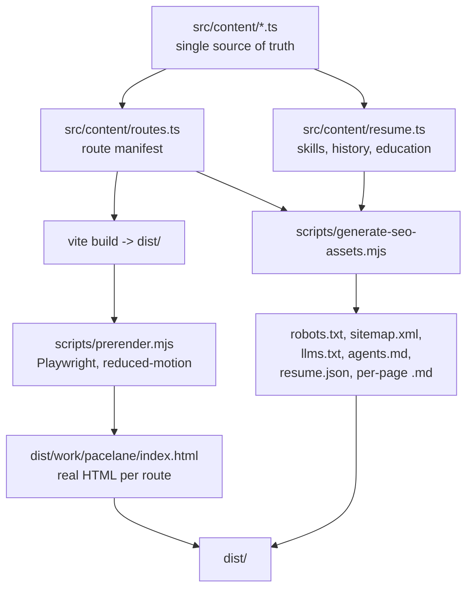

# Make the portfolio machine-readable for SEO, GEO, and recruitment agents

> Source question: "The website needs to be extremely easy to scan and crawl for AI Agents and LLMs. How can we make this website super scannable for search engines SEO, and LLMs like GEO, and for AI Agents that work as recruitment agents?"

## The core problem

The site is a client-only SPA. [vite.config.ts](../vite.config.ts) sets `appType: 'spa'`, [src/main.tsx](../src/main.tsx) uses `createRoot().render()`, and [index.html](../index.html) ships nothing but an empty `<div id="root">` plus a `<title>`. Crawlers that do not execute JavaScript — GPTBot, ClaudeBot, PerplexityBot, OAI-SearchBot, and virtually every recruitment-agent scraper — currently see **zero content on all 21 URLs**.

Secondary gaps: no `robots.txt`, no `sitemap.xml`, no meta description, no Open Graph, no JSON-LD, and [src/design-system/FooterSection.tsx](../src/design-system/FooterSection.tsx) line 157 already promises a `/llms.txt` that does not exist.

## Build pipeline after this work



## Hosting recommendation

Hosting is **Netlify**, matching the rest of the portfolio. Static files shadow redirect rules, so prerendered `dist/work/pacelane.html` is served directly while unknown paths still fall back to the SPA. Add a `netlify.toml` with a catch-all 200 rewrite to `/index.html`. Prerender to flat `.html` documents rather than `<route>/index.html`: Netlify 301s a directory path to a trailing slash, which would contradict every canonical URL on the site. Pick a canonical apex domain (for example `romulosandri.com`) and hardcode it as `SITE_URL` — canonical tags, `sitemap.xml`, OG images, and JSON-LD `@id` values all need one absolute origin.

---

## Phase 1 — Prerender the SPA to static HTML

This is the foundation. Everything else is worthless if the HTML is empty.

**New: `scripts/prerender.mjs`** (devDeps: `playwright`, `sirv`)

1. Serve `dist/` on a local port.
2. For each route in the manifest, open a page with `await page.emulateMedia({ reducedMotion: 'reduce' })`. This is the critical trick — it makes `prefersReducedMotion()` in [src/motion-system/tokens.ts](../src/motion-system/tokens.ts) return `true`, so `RevealGroup` calls `setTargets(..., shownVars(...))` immediately instead of hiding text behind ScrollTrigger.
3. Wait for `networkidle` plus a `document.documentElement.dataset.prerenderReady` flag set from `App.tsx` after first paint.
4. Sanitize before serialization: strip inline `opacity`/`visibility`/`transform`/`filter` from `[data-reveal]` and `[data-reveal-group]`, remove the Phaser `<canvas>`, remove `CursorTrail`/`FooterPluto`/ticker DOM (`[aria-hidden="true"]` decorative wrappers).
5. Write `dist/<route>/index.html`.

**Wire into `package.json`:** `"build": "tsc -b && vite build && node scripts/prerender.mjs && node scripts/generate-seo-assets.mjs"`.

**Keep `createRoot().render()` — do not switch to `hydrateRoot`.** GSAP mutates the DOM with inline styles, so hydration would mismatch. React discards the prerendered markup on mount; the static HTML exists purely for crawlers. Expect a sub-frame flash, which is the standard tradeoff for SEO-only prerendering.

**New: `src/content/routes.ts`** — one exported array of every URL, derived from `workItems` and `projectItems` in [src/content/portfolio.ts](../src/content/portfolio.ts). Consumed by the prerenderer, the sitemap generator, and `llms.txt` so they can never drift apart. Exclude `?ds` and mark `/game` low-priority.

## Phase 2 — Per-route metadata

**New: `src/content/seo.ts`** — a `title`, `description`, and `ogImage` per route, derived from real content (a case study's `description` field becomes its meta description, truncated to ~155 chars).

**New: `src/lib/useDocumentHead.ts`** — an effect called from [src/App.tsx](../src/App.tsx) that imperatively sets `document.title`, `<meta name="description">`, `<link rel="canonical">`, `og:*`, and `twitter:*` on route change. Because the prerenderer runs a real browser, whatever this effect sets gets captured into the static HTML. No `react-helmet` dependency needed.

**OG images:** crawlers do not decode AVIF. Point `og:image` at the existing PNG fallbacks, for example `/images/work/pacelane/png/pacelane-cover.png`, using the `toPngSrc` helper already in [src/lib/images.ts](../src/lib/images.ts).

## Phase 3 — Content model extensions

This is the highest-leverage phase for GEO and recruiter agents, and the biggest gap. Today a case study is a paragraph plus 20-49 images with `alt=""`. There is no skills list, no dated work history, and no education anywhere.

**Extend `WorkItem` in [src/content/portfolio.ts](../src/content/portfolio.ts):**

```ts
export type WorkItem = {
  // ...existing: slug, title, year, cover, images, href, client, role, duration, description, delivered
  summary: string          // one sentence, quotable by an LLM
  tags: string[]           // "Design Systems", "AI Product", "React"
  tools: string[]          // Figma, React, TypeScript
  startDate: string        // ISO "2025-01" — replaces the unparseable "2025-2026"
  endDate: string | null   // null = ongoing
  imageAlts: string[]      // parallel to images[]
}
```

**New: `src/content/resume.ts`** — the file recruitment agents actually need: `skills` grouped by category with proficiency, `experience[]` with ISO dates and employer, `education[]`, `languages[]`, `availability` (open to work, remote, relocation), and `seniority`.

**Fix [src/content/site.ts](../src/content/site.ts):** add `location: { city: 'Palmas', region: 'Tocantins', country: 'BR' }`, a real `sameAs[]` array, and a canonical `headline`. Right now `FooterSection.tsx` and `ContactPage.tsx` hardcode placeholder socials (`https://github.com`, `https://x.com`) — those need real profile URLs or removal, since JSON-LD `sameAs` is a primary entity-resolution signal.

**Reconcile the role conflict:** `site.role` says "Product Designer", the footer says "Senior Product Designer and Design Engineer", and the home `<h1>` says "Product Designer". Pick one canonical string; inconsistency actively confuses entity extraction.

## Phase 4 — JSON-LD structured data

**New: `src/lib/jsonLd.ts`**, injected as `<script type="application/ld+json">` per route and captured by the prerenderer.

- Home: `ProfilePage` wrapping a `Person` with `name`, `jobTitle`, `address`, `email`, `sameAs`, `knowsAbout` (from `resume.skills`), `alumniOf`, `hasOccupation` with `occupationalCategory` and `skills`.
- Case studies: `CreativeWork` with `creator` pointing back to the Person `@id`, plus `about`, `keywords` (from `tags`), `dateCreated`, `image`.
- Galleries: `CollectionPage` with `ItemList`.
- Contact: `ContactPoint`.
- Global: `WebSite` and `BreadcrumbList`.

Use a stable `@id` such as `https://<domain>/#person` everywhere so every page resolves to the same entity.

## Phase 5 — Agent-facing text layer

**New: `scripts/generate-seo-assets.mjs`**, generating from the same content modules so nothing drifts:

- **`/robots.txt`** — explicit `Allow` blocks for `GPTBot`, `OAI-SearchBot`, `ChatGPT-User`, `ClaudeBot`, `Claude-User`, `PerplexityBot`, `Google-Extended`, `Applebot-Extended`, `CCBot`, `Bytespider`; `Disallow: /*?ds`; `Sitemap:` reference.
- **`/sitemap.xml`** — all routes with `lastmod`, `changefreq`, `priority`.
- **`/llms.txt`** — the concise index the footer already advertises: who Rômulo is, a one-line summary and link per page, and links to the markdown mirrors.
- **`/llms-full.txt`** — every page's markdown concatenated, for agents that want one fetch.
- **`/agents.md`** — instructions for agents: canonical facts, what to cite, how to contact, what not to infer. This is where you control the narrative an agent repeats about you.
- **`/resume.md` and `/resume.json`** — the JSON one following the [JSON Resume](https://jsonresume.org/schema) schema, which recruitment tooling already parses.
- **Per-page markdown mirrors** — `/work/pacelane.md`, `/projects/fotospin.md`, `/how-i-use-ai.md`, etc. Each carries YAML frontmatter (title, role, client, dates, tags) plus the body as prose.
- **`<link rel="alternate" type="text/markdown">`** in each prerendered page pointing at its `.md` twin, so an agent that lands on HTML can find the clean version.

**Also:** move `public/docs/BLUEPRINT-*.md` out of `public/`. Those are internal design blueprints currently served publicly and will get indexed.

## Phase 6 — Semantic HTML repairs

- [src/pages/HomePage.tsx](../src/pages/HomePage.tsx) lines 29-33: the `<h1>` is just "Product Designer". Make it the name plus role — it is the single strongest entity signal on the site.
- [src/pages/WorkCard.tsx](../src/pages/WorkCard.tsx) lines 176-191: card titles are `<span>` inside `<a>`. Promote to `<h3>`.
- `HomePage.tsx` lines 85-89 and 106-110: "About Me" and value-card titles are `<p>`. Promote to `<h2>`/`<h3>`. There are currently **no `<h3>`-`<h6>` tags anywhere** in the app.
- [src/pages/LazyImageList.tsx](../src/pages/LazyImageList.tsx) lines 63-68 and `WorkCard.tsx` line 153: images use `alt=""`. Wire in the new `imageAlts[]`. Case studies are mostly images, so this is where most of the recoverable content lives.
- [src/design-system/Letter.tsx](../src/design-system/Letter.tsx) line 21: per-letter `alt={letter}` makes the nav logo serialize as `r o m u l o s a n d r i`. Set `alt=""` on the letters and add a single `<span class="sr-only">Rômulo Sandri</span>` inside the `NameLogo` link.
- [src/pages/ProjectDetailPage.tsx](../src/pages/ProjectDetailPage.tsx) lines 25-29: `MetaField` labels are `<p>`. Use `<dl>`/`<dt>`/`<dd>` so client, role, and duration parse as key-value pairs.

## Phase 7 — Verification

- `npm run build`, then confirm `dist/work/pacelane/index.html` contains the case study description as plain text and no `opacity:0` on `[data-reveal]`.
- Fetch a built page with JavaScript disabled and confirm readable content.
- Google Rich Results Test on the JSON-LD; Lighthouse SEO on `dist`.
- Sanity check: paste a deployed case study URL into an LLM and ask it to summarize the role and outcomes.

## Sequencing note

Phases 1-2 are the unblocking work and can ship alone. Phase 3 is authoring effort on your side — the tags, outcomes, image alts, skills, and work history are facts only you have. Phases 4-5 are mechanical once Phase 3 data exists. Phase 6 is independent and can happen any time.

---

## Task checklist

- [x] Add `netlify.toml` (SPA fallback, markdown content types) and set a canonical `SITE_URL` constant
- [x] Create `src/content/routes.ts` as the shared route manifest derived from `portfolio.ts`
- [x] Build `scripts/prerender.mjs` with Playwright reduced-motion emulation, DOM sanitization, and per-route HTML output; wire into npm build
- [x] Create `src/content/seo.ts` and `src/lib/useDocumentHead.ts` for per-route title, description, canonical, OG, and Twitter tags
- [x] Extend `WorkItem` with summary, tags, tools, ISO dates, imageAlts; fix `site.ts` location and sameAs; reconcile the role string
- [x] Author `src/content/resume.ts` with skills, dated work history, education, languages, and availability
- [x] Create `src/lib/jsonLd.ts` emitting Person/ProfilePage, CreativeWork, CollectionPage, ContactPoint, WebSite, and BreadcrumbList
- [x] Build `scripts/generate-seo-assets.mjs` producing robots.txt, sitemap.xml, llms.txt, llms-full.txt, agents.md, resume.md, resume.json, and per-page markdown mirrors
- [x] Fix heading hierarchy, image alt text, NameLogo letter alts, and MetaField dl/dt/dd markup
- [x] Move `public/docs/BLUEPRINT-*.md` out of the public folder so they are not indexed
- [x] Verify prerendered HTML, JSON-LD, and generated files via `npm run verify:seo`

## Remaining TODOs for Rômulo

These are facts only you have. Each is marked `TODO` in the source.

- `SITE_URL` in [src/content/site.ts](../src/content/site.ts) — confirmed `https://romulosandri.com`. Every canonical tag, sitemap entry, and JSON-LD `@id` derives from it.
- `site.sameAs` — empty. Real LinkedIn/GitHub/X/Dribbble URLs. The same placeholders (`https://github.com`, etc.) are still in `FooterSection.tsx` and `ContactPage.tsx`.
- `site.role` — currently "Product Designer". Now the single source: the home `<h1>`, footer prose, page titles, and JSON-LD all read from it.
- `education` in [src/content/resume.ts](../src/content/resume.ts) — empty array; JSON-LD omits `alumniOf` while it stays empty.
- `availability` in `resume.ts` — confirmed 2 Sep 2026 (open to work, remote, contract, full-time; not relocation; immediate start; preferred roles include Product Designer).
- `delivered` on each case study in [src/content/portfolio.ts](../src/content/portfolio.ts) — currently lists activities. Where you have real metrics (users, revenue, adoption, ratings), adding them here is the single biggest upgrade for recruiter-facing screening.
- Per-image alt text — `imageAlts` is optional; `imageAltFor` generates positional fallbacks until it's filled in.

## Deployment notes

- `npm run build` = `tsc -b` → `vite build` → prerender → SEO assets. Roughly 15s locally.
- `npm run netlify-build` installs Chromium first; `netlify.toml` sets it as the build command.
- `npm run build:spa` skips prerendering, for fast local checks.
- `npm run verify:seo` re-runs the output checks against `dist/`.
